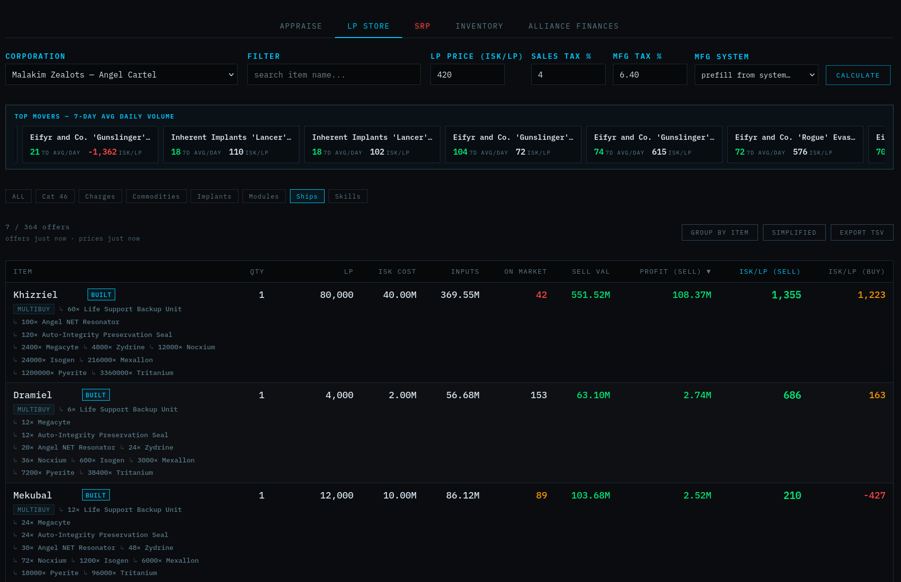
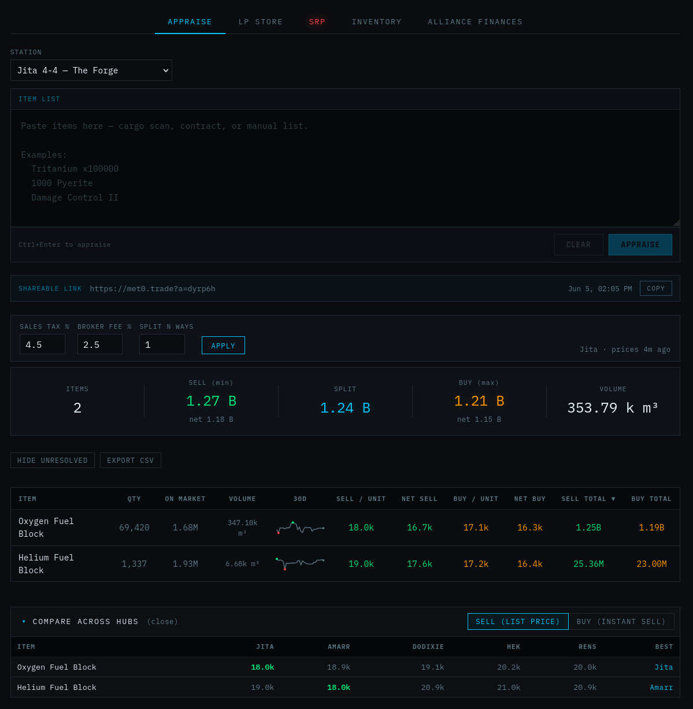
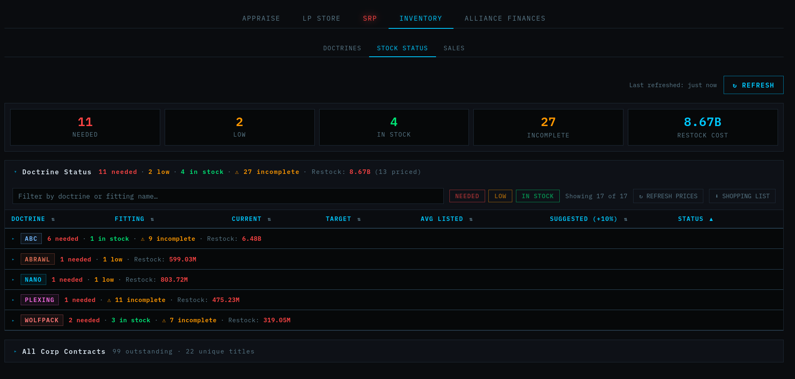
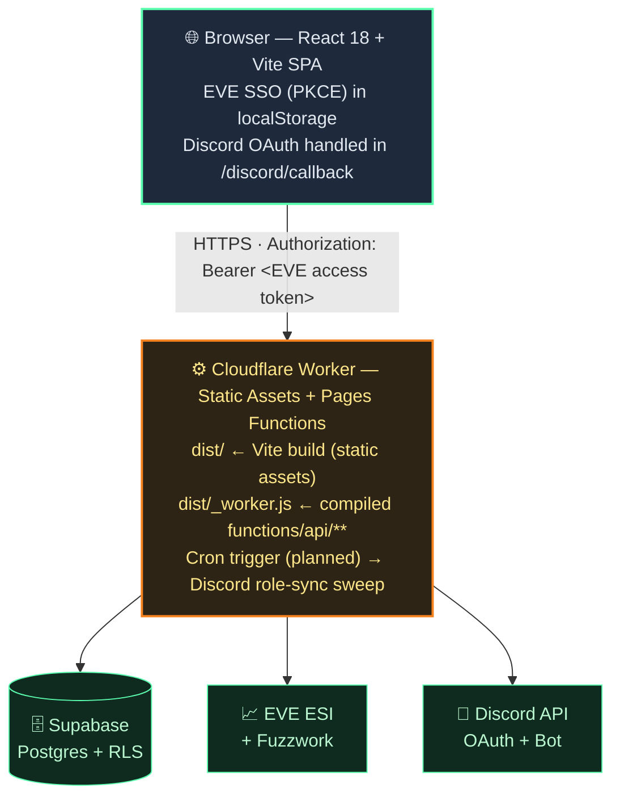

# Conduit

  
  
  
  
  
  
  
   
   
  
  

> EVE Online corp toolkit — item appraiser, LP-store calculator, SRP (ship-replacement) tracker, doctrine inventory, alliance finances (income statement, trust fund, corp-project leaderboard), and Discord role sync. Paste a cargo scan, pay a fleet loss, or grant Discord roles from in-game corp titles — all in one place.

**Stack:** React 18 + Vite → Cloudflare Workers (Static Assets + Pages Functions compiled to `_worker.js`) · Supabase (Postgres) · EVE SSO (PKCE) · Discord OAuth + Bot

> [!NOTE]
> This is a public, **scrubbed** reference implementation. Identifiers, keys, branding, and corp-specific defaults have been replaced with `REPLACE_ME` / `TODO` placeholders.

**Built by [No Tears](https://www.eve411.com/character/96236490) in-game · [@microplasticsenjoyer](https://github.com/microplasticsenjoyer) on GitHub  · with love and support from [Meta Zero](https://evemaps.dotlan.net/corp/Meta_Zero)**

**Inspired by** [AllianceAuth](https://gitlab.com/allianceauth/allianceauth) and [SeAT](https://github.com/eveseat/seat) — two long-standing community projects for EVE corps. Conduit is smaller in scope but borrows the same spirit: one place to run the boring infrastructure your corp actually depends on (auth, SRP, doctrines, corp ledgers, and Discord roles), without dragging in a whole self-hosted stack.

---

## Want to run your own copy?

Everything you need to stand up, configure, and deploy your own deployment —
EVE/Supabase/Discord setup, Cloudflare deploy, config-value reference, full
project structure / database schema / API surface, and troubleshooting — lives
in **[docs/INSTALL.md](docs/INSTALL.md)**. 

The best part about this? You can run your own instance completely free. No VPS needed!

---

## Table of contents

1. [Features](#features)
2. [Architecture](#architecture)
3. [Repurposing for your corp](#repurposing-for-your-corp)
4. [Version](#version)
5. [Credits](#credits)
6. [License](#license)

---

## Screenshots

*LP Store view - w/ selectable faction(s) and "hot" items*

*Appraisal view - the original concept of this project, similar to evepraisal/janice with some added features*

*Inventory->Stock Status view - highlights ships that are currently in stock within Corp Contracts*

---

## Features

**Access tiers:**

### Appraise tab &nbsp; 
- Paste raw EVE item lists (cargo scan, contract, D-scan, manual)
- Pick the trading hub: Jita 4-4 (default), Amarr VIII, Dodixie IX-19, Hek VIII-12, or Rens VI-8
- Live buy/sell prices via [Fuzzwork](https://market.fuzzwork.co.uk/) and item-name resolution via [EVE ESI](https://esi.evetech.net/)
- Cached typeIDs (7-day TTL) and prices (30-min TTL) in Supabase
- Every appraisal saved with a 6-char slug (`?a=x7k2p`) — one-click shareable link
- Sales tax + broker fee inputs; Summary shows post-fee NET totals
- Loot split for N members; ON MARKET column flags low-depth rows
- Multi-station compare panel highlights the best hub per item
- Per-IP rate limit on the public POST endpoint, 100k-char input cap

### LP Store tab &nbsp; 
- LP store profitability calculator for FW militia + pirate FW corporations
- Configurable LP price, sales tax, MFG tax; MFG SYSTEM picker pre-fills from ESI live cost-index
- Per-offer ISK/LP for sell-order *and* buy-order exit strategies
- Cross-faction filter, 7-day Jita volume sparkline, depth-tiered SELL VOL colouring
- Filterable by item name; deep-linkable URL state

### SRP tab &nbsp;  
- Members submit losses by pasting a zKillboard link; ship + fitted value auto-pulled from zKill; in-game kill time captured so late-pasted old kills don't count as current-month
- Leadership actions gated by `EVE_LEADERSHIP_IDS` or the `admin_users` table; every approval/rejection stamps who decided and when
- Configurable payout policy (default fraction + per-loss ISK cap) — set in `src/components/SrpTab.jsx` (`SRP_DEFAULT_PCT`, `SRP_PAYOUT_CAP`). Leaders can override per-fleet at bulk-approve time.
- Bulk approve with per-fleet payout % and cap; per-loss or whole-pilot **Pay** with timestamp
- **Alt account** flag: file a loss for an out-of-corp alt while stamping the submitting corp member
- **My SRP** view: a member's own losses across all fleets with status/ISK rollup
- Anti-double-payout: same killmail in two fleets is rejected at submission
- Monthly roundup dashboard

### Inventory tab &nbsp; 
- Doctrine library + stock tracker matched against live corp contracts; per-doctrine bulletin notes
- NEEDED / LOW / IN STOCK badges; suggested restock pricing from recent fits
- Bulk restock export; full audit changelog
- Sales sub-tab accumulates finished doctrine contracts over time (past ESI's ~30-day window)

### Alliance Finances tab &nbsp;  
- **Income Statement** — corp inflows/outflows with manual entry support
- **Corp Projects** — mirrors `esi-corporations.read_projects.v1` (Director refresh)
- **Trust Fund** — investor deposit/withdrawal/interest ledger; tier tracking (Associate → Partner); monthly interest-rate overrides; per-investor balance and principal breakdown

### Profile / Discord linking &nbsp; 
- Self-service: link Discord account via OAuth, auto-grant guild roles mirroring corp titles + FW militia

### Admin panel &nbsp; 
- Members browser, Title→Role and Militia→Role maps, runtime admin grant/revoke
- Force-refresh corp titles from ESI for any member without waiting for the next sync cycle

---

## Architecture

- **`src/`** — React frontend; one component per top-level tab, CSS Modules co-located
- **`functions/api/`** — Cloudflare Pages Functions; file tree maps directly to routes
- **`supabase/migrations/`** — Timestamped Postgres migrations (`YYYYMMDD_description.sql`)

`wrangler.jsonc` configures the Worker: static assets from `dist/` with SPA fallback, the compiled function bundle as `main`.

> [!TIP]
> For the full project tree, database schema, and complete API surface (every route + auth tier), see **[docs/INSTALL.md](docs/INSTALL.md)**.

---

## Repurposing for your corp

The pieces are decoupled enough to refit:

**Swap the corp / brand the app**:
1. Update `EVE_CORP_ID` and `EVE_LEADERSHIP_IDS` in `wrangler.jsonc`.
2. **Supply a logo:** drop a `logo.png` into both `public/logo.png` and the repo root `logo.png` (referenced by `index.html` for favicon/OG tags and by `Header.jsx`). Both files were intentionally deleted from this scrubbed mirror.
3. Update `name` in `wrangler.jsonc` and `package.json` to your Worker / repo name.
4. **Change the displayed app name:** search-and-replace `Conduit` → your name across the repo (UI strings live in `index.html` `<title>` + OG tags, `src/components/Header.jsx` (logo text), and `src/components/AuthGate.jsx` (login-screen title)).
5. **Change the storage prefix:** localStorage keys use the `Conduit:` prefix (`src/App.jsx`, `src/lib/eveAuth.js`, `src/lib/discordLink.js`, `src/lib/userPrefs.js`, and per-tab components). Search-and-replace `Conduit:` → `<yourname>:` if you want the keys to match your brand — not strictly required, but cleaner.
6. Edit `src/index.css` CSS variables (`--accent`, `--bg-panel`, `--sell`, `--buy`, etc.) for color theme.
7. Edit `src/lib/eveAuth.js` and `src/lib/discordLink.js`: the `SSO_CALLBACK_URL` and `REDIRECT_URI` constants are set to `https://your-domain.example/...` placeholders — point them at your actual deployed domain.

**Swap the LP-store corp list** (e.g. you only care about pirate FW):
- Edit `functions/api/lp/_corps.js` — registry of supported LP-store corp IDs and their faction filter rules.
- The audit script `scripts/audit-lp-faction-filter.mjs` is a one-off check for whether ESI cross-leaks items between militias; rerun it if you add corps.

**Swap the supported trading hubs:**
- Edit `functions/api/_stations.js` (server-side) and `src/lib/stations.js` (frontend mirror — same data, both must stay in sync).

**Drop tabs you don't want:**
- Remove the tab entry from `src/App.jsx`'s tab definition.
- Vite tree-shakes unused components, so the bundle stays small. The original repo already keeps `Trading.jsx` and `Hauling.jsx` files around but unwired — same pattern works in reverse.

---

## Version

---

## Credits

- **EVE Online character:** No Tears
- **GitHub:** [@microplasticsenjoyer](https://github.com/microplasticsenjoyer)
- **Inspired by:** [AllianceAuth](https://gitlab.com/allianceauth/allianceauth) and [SeAT](https://github.com/eveseat/seat)
- **Data sources:** [EVE ESI](https://esi.evetech.net/), [Fuzzwork market data](https://market.fuzzwork.co.uk/), [zKillboard](https://zkillboard.com/)

> [!IMPORTANT]
> EVE Online and the EVE logo are trademarks of CCP hf. This project is not endorsed by or affiliated with CCP. All EVE Online–related content is used under CCP's developer license terms.

---

## License

 — see the `LICENSE` file for the full text.

Forks, modifications, and commercial use are all permitted; you just need to preserve the copyright notice. If you build something cool with this, a link back to the original repo is appreciated but not required.
